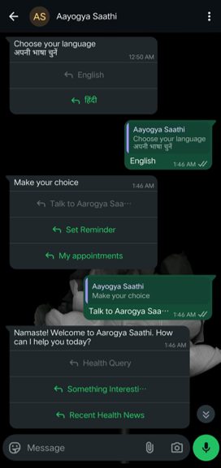
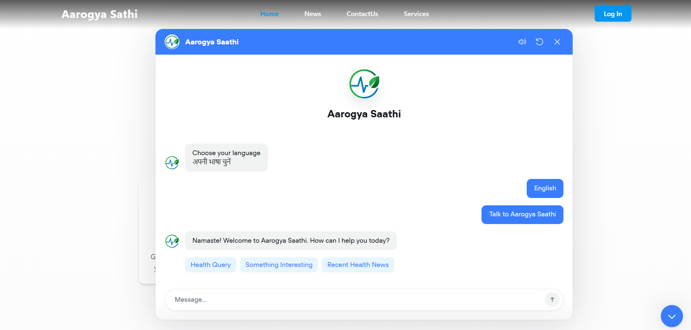
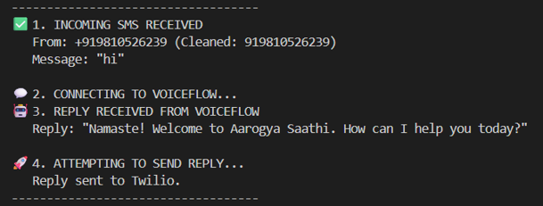

# Aarogya Saathi 🩺

**A submission for the STATE LEVEL 48 HOURS HACKATHON 2025 by Team Byte Brains.** 

`Aarogya Saathi` is an AI-powered solution designed to generate health awareness and bridge the information access gap in healthcare.

## 🚨 The Problem: A Silent Health Crisis

A significant portion of the population, particularly in rural areas, lacks access to basic health information.

> 18% of rural households (approx. **16.45 crore people**) are unaware of basic symptoms and preventive healthcare measures.
>
> Among rural youth, **30% (approx. 2.5 crore**) cannot perform a simple internet search, highlighting a digital literacy gap.

## 💡 Our Solution

**Aarogya Saathi** is an accessible, multi-platform AI chatbot that provides reliable health information to everyone, everywhere.

Our goal is to serve the **16.45 crore people** who are currently unaware of basic preventive healthcare.

### Key Features

  * **Multi-Lingual:** Users can interact in their preferred language (e.g., English, Hindi).
  * **Multi-Platform Access:** We reach users where they are:
      * **WhatsApp:** Accessible to over 36.7 crore rural users.
      * **SMS:** Works on any mobile phone, no internet required.
      * **Web/PC:** A full-featured web interface for desktop users.
  * **Offline Availability:** Designed to work even without a stable internet connection.
  * **Reliable Data:** Our AI is fed data from trusted sources, including:
      * WHO (World Health Organization) datasets.
      * AIIMS (All India Institute of Medical Sciences) datasets.
      * Top medical institutes and organizations.
  * **Core Functions:** Users can ask health queries, get reminders, find interesting health facts, and receive recent health news.

## 📸 Screenshots

Here’s a look at Aarogya Saathi in action:

| WhatsApp Interface| Web Interface | SMS (Backend) |
| :---: | :---: | :---: |
||  |  |
 
 


*Screenshots adapted from presentation content.*

## 🛠️ Tech Stack

This project was built using a modern, robust set of technologies:

  * **Frontend:** React, Tailwind CSS
  * **Backend:** Node.js
  * **AI & Logic:** Voiceflow
  * **API & Services:** Twilio (for SMS/WhatsApp), Postman (for API testing)
  * **Deployment:** Vercel, Replit

## 🚀 Getting Started

*(Placeholder: You can add instructions on how to run this project locally.)*

```bash
# Clone the repository
git clone https://github.com/your-username/aarogya-saathi.git
cd aarogya-saathi

# Install dependencies
npm install

# Run the app
npm start
```

## 🧠 Team: Byte Brains

  * **Vansh Raheja** (60644)
  * **Gulnawaj** (60618) 
  * **Raj Khatri** (60589)
  * **Aman Panwar** (60604) 
  * **Manik Bhatt** (60626)

## 📚 Research & References

Our problem statement and data are based on research from the following sources:

  * [ASER Centre Report on Digital Readiness]
  * [DEF India Report on WhatsApp in Rural India]
  * [PIB Press Note on Rural Youth]
  * [AIIMS, CDSCO, and PMC (NCBI) medical data]

[]: #
[]: #
[]: #
